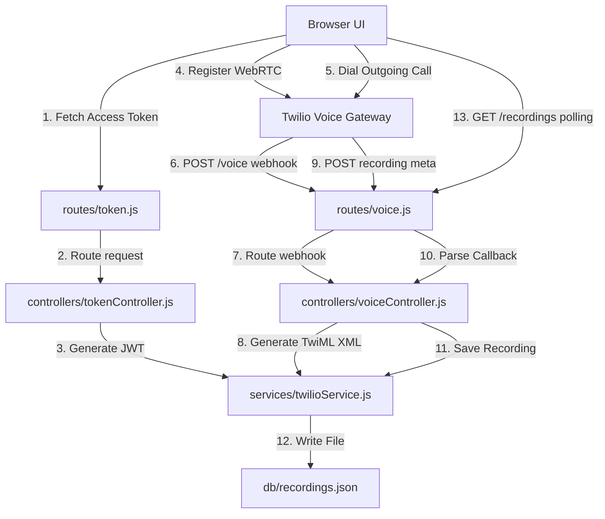

# 📞 VoIP Web Dialer Dashboard

A modern, responsive, and secure WebRTC VoIP web dialer application powered by **Twilio Voice SDK**, **Node.js (Express)**, and **Vanilla JavaScript**. This project features real-time browser-to-phone (and phone-to-browser) calling, automatic dual-channel call recording, and a persistent call history database displayed in a sleek glassmorphic dashboard.

---

## 🚀 Features

* **Bi-directional WebRTC Calling**: Place outbound calls from the browser to mobile numbers and receive incoming calls to your Twilio number inside the browser interface.
* **Outbound REST API Calls**: Trigger automated tests via the REST client.
* **Automatic Call Recording**: All calls are recorded in high-quality dual-channel (stereo) audio.
* **Persistent Call History**: Audio recordings and metadata are persisted in a JSON file (`db/recordings.json`) on the server.
* **Beautiful Glassmorphism UI**:
  * Persistent recording history sidebar on the **far left**.
  * Fully interactive, centered dialer keypad with real-time status alerts.
  * Real-time MP3 playback and download links directly integrated into the client-side log screen.
* **Modular Clean Architecture**: Clean separation of concerns using **Routes**, **Controllers**, **Services** (MVC pattern) on the backend, and **ES Modules** on the frontend.
* **Responsive Layout**: Designed to adapt elegantly; stacks vertically on mobile screens.

---

## 🔑 How to Retrieve Twilio Credentials (`.env`)

To configure your `.env` file, you will need to gather credentials from your Twilio Console. Follow these steps:

### 1. `Account_SID` & `Auth_Token`
* **Where to find**: Open your [Twilio Console Dashboard](https://console.twilio.com/).
* **How to get**: Scroll down to the **Account Info** section. You will see both your **Account SID** (starts with `AC...`) and your **Auth Token** (click "Show" to copy).

### 2. `API_Key_SID` & `API_Key_Secret`
WebRTC browser clients require a secure Access Token to register. Generating these tokens requires an API Key instead of your main Account password:
* **Where to find**: Go to **Console** ➔ **Account** ➔ **API Keys & Tokens** ➔ **API Keys** (or search "API Keys" in the top bar).
* **How to get**:
  1. Click **Create API Key**.
  2. Give it a name (e.g. `VoIP Web Dialer Key`).
  3. Set the region to `US1` (or your default) and set Key Type to **Standard**.
  4. Click **Create API Key**.
  5. Copy the **SID** (starts with `SK...`) and the **Secret** (only shown once!). Paste these as `API_Key_SID` and `API_Key_Secret` in your `.env`.

### 3. `TwiML_App_SID`
This represents the voice application config that translates browser-initiated call streams into actual phone numbers:
* **Where to find**: Go to **Console** ➔ **Voice** ➔ **Manage** ➔ **TwiML Apps**.
* **How to get**:
  1. Click **Create new TwiML App**.
  2. Give it a name (e.g. `VoIP Web App`).
  3. Under the **Voice** section, you will set the **Request URL** (use your ngrok URL with `/voice` as explained in the running guide below).
  4. Click **Save**.
  5. Once saved, click on the app name. Copy the **Application SID** (starts with `AP...`) and paste it as `TwiML_App_SID` in your `.env`.

### 4. `Twilio_Phone_Number`
* **Where to find**: Go to **Console** ➔ **Phone Numbers** ➔ **Manage** ➔ **Active Numbers**.
* **How to get**: Copy your active phone number (in E.164 format, e.g. `+12674522993`). Paste it as `Twilio_Phone_Number` in your `.env`.

### 5. `My_Phone_Number`
* **How to get**: Paste your personal mobile phone number (including country code, e.g. `+2010xxxxxxxx`) to test receiving REST-triggered calls or outbound routing tests.

---

## 🌐 Set up ngrok Step-by-Step

Because Twilio communicates with your application using HTTP webhooks, your local server (`localhost:5000`) must be reachable from the internet. **ngrok** creates a secure public tunnel to your local environment.

### Step 1: Install ngrok
* **Windows**: Download the zip from the [ngrok website](https://ngrok.com/download), extract it, and place `ngrok.exe` in a convenient directory. Or install via Chocolatey:
  ```bash
  choco install ngrok
  ```

### Step 2: Authenticate ngrok
Sign up for a free account at ngrok, copy your authtoken from your dashboard, and run:
```bash
ngrok config add-authtoken <YOUR_NGROK_AUTHTOKEN>
```

### Step 3: Run ngrok on Port 5000
Once your Express server is running locally on port 5000, start the tunnel:
```bash
ngrok http 5000
```
This will open a terminal dashboard showing your forwarding URL:
```text
Forwarding     https://a1b2-34-56-78.ngrok-free.app -> http://localhost:5000
```
Keep this terminal open. Copy the HTTPS forwarding address (`https://*.ngrok-free.app`).

> [!WARNING]
> ### ⚠️ Critical Note for Developers: Dynamic ngrok URLs & Twilio Integration
> 
> * **The Dynamic URL Issue:** Running the standard free command `ngrok http 5000` generates a brand new, randomized URL (e.g. `https://a1b2-34-56-78.ngrok-free.app`) every time you restart the process.
> * **Impact on Twilio & TwiML App:** Twilio dispatches active call Webhooks to the destination URL saved inside your **TwiML App** settings. If the ngrok URL changes and is not updated in Twilio, calls will fail immediately with connection timeouts because Twilio will attempt to route traffic to the expired domain.
> 
> **💡 Manual Solution (Update URL on Every Restart):**
> Every time you run ngrok and receive a new temporary domain, you must:
> 1. Copy the new HTTPS URL from the terminal.
> 2. Go to **Twilio Console** ➔ **Voice** ➔ **Manage** ➔ **TwiML Apps** ➔ Select your App.
> 3. Update the **Voice Request URL** field to the new URL with the `/voice` route (e.g., `https://xxxx.ngrok-free.app/voice`).
> 4. Click **Save**.
> 
> **🚀 Professional Solution (Static Free Domain):**
> To avoid configuring Twilio manually on every restart, claim a permanent free subdomain in your ngrok account:
> 1. Log in to the ngrok dashboard and claim your free static domain (e.g., `mahmoud-voip.ngrok-free.app`).
> 2. Initialize the tunnel using the `--url` flag to associate it with your reserved domain:
>    ```bash
>    ngrok http --url=mahmoud-voip.ngrok-free.app 5000
>    ```
> 3. Point your Twilio **TwiML App** voice request URL to this static address (e.g., `https://mahmoud-voip.ngrok-free.app/voice`) **once**, and you will never need to update the Twilio Console settings again.

---

## 📁 File Structure

```text
twilio/
├── db/
│   └── recordings.json        # Persistent JSON database for call recordings
├── controllers/
│   ├── tokenController.js     # Manages token request-response flows
│   └── voiceController.js     # Manages webhook and REST call request-response flows
├── routes/
│   ├── token.js               # Route binding for client Access Tokens
│   └── voice.js               # Route bindings for TwiML voice and callbacks
├── services/
│   └── twilioService.js       # Core business logic (Twilio SDK integrations)
├── public/                    # Frontend Static Assets
│   ├── css/
│   │   └── style.css          # Styling (Vanilla CSS with custom Dark Glassmorphism)
│   ├── js/
│   │   ├── app.js             # Main bootstrap and UI actions binding
│   │   ├── ui.js              # DOM selection and logging console handlers
│   │   ├── state.js           # Shared calling states
│   │   ├── device.js          # Twilio Device WebRTC WebRTCDevice initialization
│   │   ├── call.js            # Keypad actions, call connection/disconnection
│   │   └── recording.js       # Sidebar listing and polling for new recordings
│   └── index.html             # UI Structure
├── .env                       # Environment credentials (Git-ignored)
├── server.js                  # Main server entrypoint (Express)
├── package.json               # Dependencies and scripts configuration
└── README.md                  # Project documentation
```

---

## 🧠 Codebase Architecture & Code Explanation

This application is built with a highly decoupled, modular structure conforming to standard backend and frontend patterns.



### 1. Backend Layer (MVC Pattern)
* **Entry Point (`server.js`)**:
  * Initializes the Express application.
  * Mounts static folder middleware (`app.use(express.static('public'))`) to serve the front-end HTML layout, CSS files, and JS modules.
  * Attaches urlencoded body parsers (`express.urlencoded({ extended: false })`) to parse POST payload bodies sent from Twilio callback webhooks.
  * Directs requests to routers: `routes/token.js` and `routes/voice.js`.
* **Routers (`routes/`)**:
  * **`routes/token.js`**: Maps `GET /` directly to the token generation controller.
  * **`routes/voice.js`**: Maps webhooks and data endpoints:
    * `POST /voice` (handles voice dialing routing).
    * `POST /call` (triggers an outbound REST API test call).
    * `POST /recording-callback` (receives call recording metadata).
    * `GET /recordings` (retrieves the persistent list of recordings).
* **Controllers (`controllers/`)**:
  * **`tokenController.js`**: Fetches the query identity parameter (defaulting to `mahmoud_browser`) and calls the token service. Wraps output with standard HTTP response headers.
  * **`voiceController.js`**: Receives webhook calls from Twilio. Extracts routing values (`To`, `From`) and request host (needed for dynamic ngrok callback routing). Maps results to XML response payloads.
* **Services (`services/twilioService.js`)**:
  * **`getAccessTokenResponse(identity)`**: Instantiates `twilio.jwt.AccessToken` using the main account SID and the specific Voice API Key credentials. Attaches a `VoiceGrant` configured with `incomingAllow: true` and pointing to the `TwiML_App_SID`. Returns a JWT token allowing WebRTC device registration.
  * **`getVoiceWebhookResponse(to, from, host)`**: Generates XML responses using `twilio.twiml.VoiceResponse`.
    * If `to` matches `Twilio_Phone_Number`, it signifies an incoming call; the service answers the call and bridges the stream to the registered browser client (`mahmoud_browser`) using `<Dial><Client>mahmoud_browser</Client></Dial>`.
    * If `to` is a different phone number, it indicates an outgoing call placed from the browser; it dials out to the target mobile number using `<Dial callerId="...">`.
    * Both flows automatically configure the `record: 'record-from-answer-dual'` attribute and attach the `recordingStatusCallback` webhook pointing back to our server.
  * **`handleRecordingCallback(body)`**: Receives Twilio's asynchronous recording callback. Extracts `CallSid`, `RecordingSid`, `RecordingDuration`, and the `.mp3` file URL. Appends the record into `db/recordings.json` and manages database truncation (keeps the last 100 entries).

### 2. Frontend Layer (ES Modules)
* **`state.js`**:
  * Holds reactive variables representing the active `twilioDevice` and the active `activeCall` connection instance, sharing states across frontend files.
* **`ui.js`**:
  * Caches elements (inputs, buttons, overlays).
  * Implements `log(msg, type)`: Prints timestamped, color-coded HTML text directly onto the page's "System Console Logs" panel for real-time developer tracking.
* **`device.js`**:
  * **`initializeTwilioDevice()`**: Sends a fetch request to `/token`. Passes the retrieved JWT token to `new Twilio.Device(token, { codecPreferences: ['opus', 'pcmu'] })` to establish a secure WebRTC socket.
  * Registers device events:
    * `registered`: Changes status dot to green and alerts that the dialer is ready.
    * `incoming`: Listens for incoming phone calls. When triggered, it grabs the call object, stores it in `state.activeCall`, and prompts the user with the glassmorphic overlay.
* **`call.js`**:
  * **`placeOutgoingCall()`**: Pulls the destination phone number. Calls `twilioDevice.connect({ params: { To: num } })`. The returned call object is registered, and event listeners (`accept`, `disconnect`, `reject`) are mounted to toggle button states.
  * **`disconnectCall()`**: Gracefully terminates the WebRTC stream via `activeCall.disconnect()`.
  * **`toggleMute()`**: Invokes `activeCall.mute(isMuted)` to disable/enable local audio inputs.
* **`recording.js`**:
  * **`pollRecordings()`**: Sends periodic `GET /recordings` fetch requests. Parses the response payload and updates the left-side sidebar container dynamically:
    * If a new `recordingSid` is discovered, it appends a direct clickable play/download anchor link (`<a>` tag with styled green block buttons) into the developer logs screen and updates the sidebar.
* **`app.js`**:
  * Coordinates document startup.
  * Prompts the browser for audio microphone access (`navigator.mediaDevices.getUserMedia`) early to prevent permission latency during call setups.
  * Starts the device registration flow and schedules the recording polling interval.

### 3. Detailed Twilio Service Reference (`services/twilioService.js`)

This service encapsulates all core Twilio logic, TwiML generation, and filesystem-based database persistence operations.

---

#### 🔹 `getAccessTokenResponse(rawIdentity)`
Generates a secure JSON Web Token (JWT) required to register the client-side browser WebRTC Device with Twilio's VoIP gateway.
* **Parameters:**
  * `rawIdentity` `(string)`: The unique client ID representing the browser client (defaults to `mahmoud_browser`).
* **Workflow:**
  1. Instantiates `twilio.jwt.AccessToken` using `Account_SID`, `API_Key_SID`, and `API_Key_Secret`.
  2. Configures a `VoiceGrant` with `incomingAllow: true` (enables incoming calls) and sets `outgoingApplicationSid` to the `TwiML_App_SID`.
  3. Attaches the grant to the token and generates the JWT.
* **Returns:**
  ```json
  {
    "status": 200,
    "data": {
      "identity": "mahmoud_browser",
      "token": "eyJhbGciOi..."
    }
  }
  ```

---

#### 🔹 `getVoiceWebhookResponse(to, from, host)`
Processes call routing dynamically and generates standard TwiML XML responses based on incoming/outgoing target parameters.
* **Parameters:**
  * `to` `(string)`: The target phone number or client identifier.
  * `from` `(string)`: The calling party.
  * `host` `(string)`: The request domain (e.g. ngrok tunnel domain) used to construct absolute webhook URLs.
* **Dialing Scenarios:**
  * **Incoming Call (To Twilio Phone Number):**
    If the caller dialed the Twilio phone number, Twilio answers and routes it to the WebRTC client:
    ```xml
    <Response>
      <Dial record="record-from-answer-dual" recordingStatusCallback="https://<ngrok>/recording-callback">
        <Client>mahmoud_browser</Client>
      </Dial>
    </Response>
    ```
  * **Outgoing Call (To Any Phone Number):**
    If the client dialed a number from the browser keypad, Twilio calls the external line:
    ```xml
    <Response>
      <Dial callerId="<twilio-phone-number>" record="record-from-answer-dual" recordingStatusCallback="https://<ngrok>/recording-callback">
        <Number>+2010...</Number>
      </Dial>
    </Response>
    ```
* **Returns:** An object with `{ status: 200, type: 'text/xml', content: '<TwiML XML string>' }`.

---

#### 🔹 `getTestCallResponse(host)`
Triggers an automated outbound call programmatically using the Twilio REST Client API.
* **Parameters:**
  * `host` `(string)`: The domain name used to construct recording callback webhooks.
* **Workflow:**
  1. Calls `twilioClient.calls.create()`.
  2. Sets destination to `My_Phone_Number` and caller ID to `Twilio_Phone_Number`.
  3. Configures dual-channel recording and the status callback.
* **Returns:**
  ```json
  {
    "status": 200,
    "message": "call has been sent"
  }
  ```

---

#### 🔹 `handleRecordingCallback(body)`
Acts as the webhook handler for Twilio's async recording status events. Saves audio links and durations to local storage.
* **Parameters:**
  * `body` `(object)`: Parsed POST body from Twilio containing: `CallSid`, `RecordingSid`, `RecordingDuration`, `RecordingUrl`.
* **Workflow:**
  1. Reads existing calls history from `db/recordings.json`.
  2. Compiles a JSON object containing SIDs, call duration, timestamp, and a direct link to the `.mp3` media.
  3. Inserts the record at index `0` and trims the array if it exceeds 100 entries.
  4. Saves the updated history back to the database.
* **Returns:**
  ```json
  {
    "status": 200,
    "message": "Recording metadata saved successfully."
  }
  ```

---

#### 🔹 `getRecordingsList()`
A simple query function retrieving the persistent recordings list.
* **Returns:**
  ```json
  {
    "status": 200,
    "data": [
      {
        "callSid": "CA...",
        "recordingSid": "RE...",
        "duration": "12",
        "url": "https://api.twilio.com/.../RE....mp3",
        "timestamp": "2026-05-20T12:00:00.000Z"
      }
    ]
  }
  ```

---

## 🏃‍♂️ How to Run the Project

### Step 1: Install Dependencies
Run the following command in the project root:
```bash
npm install
```

### Step 2: Configure Environment Variables
Create a `.env` file at the root level using the credentials retrieved in the **How to Retrieve Twilio Credentials** section.

### Step 3: Start the Local Server
```bash
npm start
```
The server will start listening at `http://localhost:5000`.

### Step 4: Expose Server with ngrok
Run ngrok in a separate terminal:
```bash
ngrok http 5000
```
Copy the generated HTTPS Forwarding URL (e.g., `https://xxxx.ngrok-free.app`).

### Step 5: Configure Twilio TwiML App
1. Go to the **Twilio Console** ➔ **TwiML Apps**.
2. Select your TwiML App.
3. In the **Voice Configuration** section, paste your ngrok URL with the `/voice` path in the **Request URL** field:
   `https://xxxx.ngrok-free.app/voice`
4. Set the HTTP method to **POST**.
5. Save changes.

### Step 6: Open & Run the App
Open `http://localhost:5000` in your web browser, grant microphone access when prompted, and start placing and receiving calls!

### Step 7: (Optional) Disable Media URL Authentication
By default, Twilio secures recording links. To play/download them immediately from the dashboard sidebar without credentials:
1. Go to **Twilio Console** ➔ **Voice** ➔ **Settings** ➔ **General**.
2. Find the setting **HTTP Basic Authentication for media access**.
3. Set it to **Disabled** and click **Save**.

---

## ⚠️ Troubleshooting & WebRTC Gotchas

### 1. Browser Microphone Permission / WebRTC Security
* **HTTPS Requirement**: WebRTC APIs (specifically `navigator.mediaDevices.getUserMedia`) require a **Secure Context**. Browsers will refuse to prompt for microphone permissions if the page is accessed via an unencrypted local network IP (e.g. `http://192.168.1.50:5000`).
* **How to test securely**:
  * Use `http://localhost:5000` (modern browsers automatically treat `localhost` as a secure domain).
  * Access the app through the secure **HTTPS URL** provided by ngrok (`https://xxxx.ngrok-free.app`).

### 2. Twilio Trial Account Restrictions
If you are testing this application using a free Twilio Trial Account, keep these limitations in mind:
* **Verified Caller IDs**: You can only place outbound calls to phone numbers that you have explicitly verified in your Twilio Console under **Phone Numbers** ➔ **Verified Caller IDs**. Calling any other number will result in a Twilio Error.
* **Trial Upgrades**: To call any arbitrary phone number globally, you must upgrade your Twilio account by adding a credit card.

### 3. Port Conflicts
If you receive an `EADDRINUSE: address already in use :::5000` error:
* Check for orphaned `node` processes running in the background.
* On Windows (PowerShell), terminate them by running:
  ```powershell
  taskkill /F /IM node.exe
  ```

