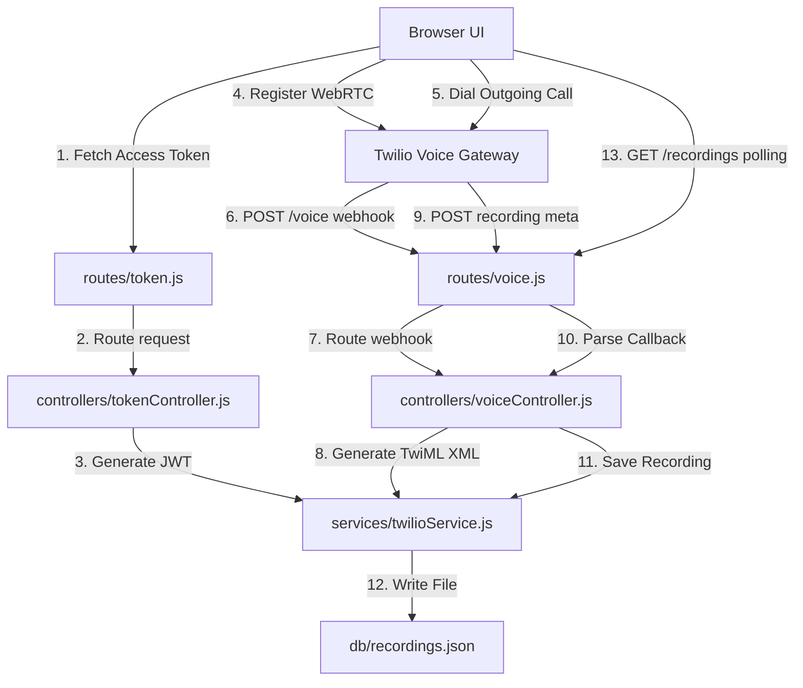

# 📞 VoIP Web Dialer Dashboard

A modern, responsive, and secure WebRTC VoIP web dialer application powered by **Twilio Voice SDK**, **Node.js (Express)**, and **Vanilla JavaScript**. This project features real-time browser-to-phone (and phone-to-browser) calling, automatic dual-channel call recording, and a persistent call history database displayed in a sleek glassmorphic dashboard.

---

## 🚀 Features

* **Bi-directional WebRTC Calling**: Place outbound calls from the browser to mobile numbers and receive incoming calls to your Twilio number inside the browser interface.
* **Outbound REST API Calls**: Trigger automated tests via the REST client.
* **Automatic Call Recording**: All calls are recorded in high-quality dual-channel (stereo) audio.
* **Persistent Call History**: Audio recordings and metadata are persisted in a JSON file (`db/recordings.json`) on the server.
* **Beautiful Glassmorphism UI**:
  * Persistent recording history sidebar on the **far left**.
  * Fully interactive, centered dialer keypad with real-time status alerts.
  * Real-time MP3 playback and download links directly integrated into the client-side log screen.
* **Modular Clean Architecture**: Clean separation of concerns using **Routes**, **Controllers**, **Services** (MVC pattern) on the backend, and **ES Modules** on the frontend.
* **Responsive Layout**: Designed to adapt elegantly; stacks vertically on mobile screens.

---

## 🔑 How to Retrieve Twilio Credentials (`.env`)

To configure your `.env` file, you will need to gather credentials from your Twilio Console. Follow these steps:

### 1. `Account_SID` & `Auth_Token`
* **Where to find**: Open your [Twilio Console Dashboard](https://console.twilio.com/).
* **How to get**: Scroll down to the **Account Info** section. You will see both your **Account SID** (starts with `AC...`) and your **Auth Token** (click "Show" to copy).

### 2. `API_Key_SID` & `API_Key_Secret`
WebRTC browser clients require a secure Access Token to register. Generating these tokens requires an API Key instead of your main Account password:
* **Where to find**: Go to **Console** ➔ **Account** ➔ **API Keys & Tokens** ➔ **API Keys** (or search "API Keys" in the top bar).
* **How to get**:
  1. Click **Create API Key**.
  2. Give it a name (e.g. `VoIP Web Dialer Key`).
  3. Set the region to `US1` (or your default) and set Key Type to **Standard**.
  4. Click **Create API Key**.
  5. Copy the **SID** (starts with `SK...`) and the **Secret** (only shown once!). Paste these as `API_Key_SID` and `API_Key_Secret` in your `.env`.

### 3. `TwiML_App_SID`
This represents the voice application config that translates browser-initiated call streams into actual phone numbers:
* **Where to find**: Go to **Console** ➔ **Voice** ➔ **Manage** ➔ **TwiML Apps**.
* **How to get**:
  1. Click **Create new TwiML App**.
  2. Give it a name (e.g. `VoIP Web App`).
  3. Under the **Voice** section, you will set the **Request URL** (use your ngrok URL with `/voice` as explained in the running guide below).
  4. Click **Save**.
  5. Once saved, click on the app name. Copy the **Application SID** (starts with `AP...`) and paste it as `TwiML_App_SID` in your `.env`.

### 4. `Twilio_Phone_Number`
* **Where to find**: Go to **Console** ➔ **Phone Numbers** ➔ **Manage** ➔ **Active Numbers**.
* **How to get**: Copy your active phone number (in E.164 format, e.g. `+12674522993`). Paste it as `Twilio_Phone_Number` in your `.env`.

### 5. `My_Phone_Number`
* **How to get**: Paste your personal mobile phone number (including country code, e.g. `+2010xxxxxxxx`) to test receiving REST-triggered calls or outbound routing tests.

---

## 🌐 Set up ngrok Step-by-Step

Because Twilio communicates with your application using HTTP webhooks, your local server (`localhost:5000`) must be reachable from the internet. **ngrok** creates a secure public tunnel to your local environment.

### Step 1: Install ngrok
* **Windows**: Download the zip from the [ngrok website](https://ngrok.com/download), extract it, and place `ngrok.exe` in a convenient directory. Or install via Chocolatey:
  ```bash
  choco install ngrok
  ```

### Step 2: Authenticate ngrok
Sign up for a free account at ngrok, copy your authtoken from your dashboard, and run:
```bash
ngrok config add-authtoken <YOUR_NGROK_AUTHTOKEN>
```

### Step 3: Run ngrok on Port 5000
Once your Express server is running locally on port 5000, start the tunnel:
```bash
ngrok http 5000
```
This will open a terminal dashboard showing your forwarding URL:
```text
Forwarding     https://a1b2-34-56-78.ngrok-free.app -> http://localhost:5000
```
Keep this terminal open. Copy the HTTPS forwarding address (`https://*.ngrok-free.app`).

> [!WARNING]
> ### ⚠️ Critical Note for Developers: Dynamic ngrok URLs & Twilio Integration
> 
> * **The Dynamic URL Issue:** Running the standard free command `ngrok http 5000` generates a brand new, randomized URL (e.g. `https://a1b2-34-56-78.ngrok-free.app`) every time you restart the process.
> * **Impact on Twilio & TwiML App:** Twilio dispatches active call Webhooks to the destination URL saved inside your **TwiML App** settings. If the ngrok URL changes and is not updated in Twilio, calls will fail immediately with connection timeouts because Twilio will attempt to route traffic to the expired domain.
> 
> **💡 Manual Solution (Update URL on Every Restart):**
> Every time you run ngrok and receive a new temporary domain, you must:
> 1. Copy the new HTTPS URL from the terminal.
> 2. Go to **Twilio Console** ➔ **Voice** ➔ **Manage** ➔ **TwiML Apps** ➔ Select your App.
> 3. Update the **Voice Request URL** field to the new URL with the `/voice` route (e.g., `https://xxxx.ngrok-free.app/voice`).
> 4. Click **Save**.
> 
> **🚀 Professional Solution (Static Free Domain):**
> To avoid configuring Twilio manually on every restart, claim a permanent free subdomain in your ngrok account:
> 1. Log in to the ngrok dashboard and claim your free static domain (e.g., `mahmoud-voip.ngrok-free.app`).
> 2. Initialize the tunnel using the `--url` flag to associate it with your reserved domain:
>    ```bash
>    ngrok http --url=mahmoud-voip.ngrok-free.app 5000
>    ```
> 3. Point your Twilio **TwiML App** voice request URL to this static address (e.g., `https://mahmoud-voip.ngrok-free.app/voice`) **once**, and you will never need to update the Twilio Console settings again.

---

## 📁 File Structure

```text
twilio/
├── db/
│   └── recordings.json        # Persistent JSON database for call recordings
├── controllers/
│   ├── tokenController.js     # Manages token request-response flows
│   └── voiceController.js     # Manages webhook and REST call request-response flows
├── routes/
│   ├── token.js               # Route binding for client Access Tokens
│   └── voice.js               # Route bindings for TwiML voice and callbacks
├── services/
│   └── twilioService.js       # Core business logic (Twilio SDK integrations)
├── public/                    # Frontend Static Assets
│   ├── css/
│   │   └── style.css          # Styling (Vanilla CSS with custom Dark Glassmorphism)
│   ├── js/
│   │   ├── app.js             # Main bootstrap and UI actions binding
│   │   ├── ui.js              # DOM selection and logging console handlers
│   │   ├── state.js           # Shared calling states
│   │   ├── device.js          # Twilio Device WebRTC WebRTCDevice initialization
│   │   ├── call.js            # Keypad actions, call connection/disconnection
│   │   └── recording.js       # Sidebar listing and polling for new recordings
│   └── index.html             # UI Structure
├── .env                       # Environment credentials (Git-ignored)
├── server.js                  # Main server entrypoint (Express)
├── package.json               # Dependencies and scripts configuration
└── README.md                  # Project documentation
```

---

## 🧠 Codebase Architecture & Code Explanation

This application is built with a highly decoupled, modular structure conforming to standard backend and frontend patterns.



### 1. Backend Layer (MVC Pattern)
* **Entry Point (`server.js`)**:
  * Initializes the Express application.
  * Mounts static folder middleware (`app.use(express.static('public'))`) to serve the front-end HTML layout, CSS files, and JS modules.
  * Attaches urlencoded body parsers (`express.urlencoded({ extended: false })`) to parse POST payload bodies sent from Twilio callback webhooks.
  * Directs requests to routers: `routes/token.js` and `routes/voice.js`.
* **Routers (`routes/`)**:
  * **`routes/token.js`**: Maps `GET /` directly to the token generation controller.
  * **`routes/voice.js`**: Maps webhooks and data endpoints:
    * `POST /voice` (handles voice dialing routing).
    * `POST /call` (triggers an outbound REST API test call).
    * `POST /recording-callback` (receives call recording metadata).
    * `GET /recordings` (retrieves the persistent list of recordings).
* **Controllers (`controllers/`)**:
  * **`tokenController.js`**: Fetches the query identity parameter (defaulting to `mahmoud_browser`) and calls the token service. Wraps output with standard HTTP response headers.
  * **`voiceController.js`**: Receives webhook calls from Twilio. Extracts routing values (`To`, `From`) and request host (needed for dynamic ngrok callback routing). Maps results to XML response payloads.
* **Services (`services/twilioService.js`)**:
  * **`getAccessTokenResponse(identity)`**: Instantiates `twilio.jwt.AccessToken` using the main account SID and the specific Voice API Key credentials. Attaches a `VoiceGrant` configured with `incomingAllow: true` and pointing to the `TwiML_App_SID`. Returns a JWT token allowing WebRTC device registration.
  * **`getVoiceWebhookResponse(to, from, host)`**: Generates XML responses using `twilio.twiml.VoiceResponse`.
    * If `to` matches `Twilio_Phone_Number`, it signifies an incoming call; the service answers the call and bridges the stream to the registered browser client (`mahmoud_browser`) using `<Dial><Client>mahmoud_browser</Client></Dial>`.
    * If `to` is a different phone number, it indicates an outgoing call placed from the browser; it dials out to the target mobile number using `<Dial callerId="...">`.
    * Both flows automatically configure the `record: 'record-from-answer-dual'` attribute and attach the `recordingStatusCallback` webhook pointing back to our server.
  * **`handleRecordingCallback(body)`**: Receives Twilio's asynchronous recording callback. Extracts `CallSid`, `RecordingSid`, `RecordingDuration`, and the `.mp3` file URL. Appends the record into `db/recordings.json` and manages database truncation (keeps the last 100 entries).

### 2. Frontend Layer (ES Modules)
* **`state.js`**:
  * Holds reactive variables representing the active `twilioDevice` and the active `activeCall` connection instance, sharing states across frontend files.
* **`ui.js`**:
  * Caches elements (inputs, buttons, overlays).
  * Implements `log(msg, type)`: Prints timestamped, color-coded HTML text directly onto the page's "System Console Logs" panel for real-time developer tracking.
* **`device.js`**:
  * **`initializeTwilioDevice()`**: Sends a fetch request to `/token`. Passes the retrieved JWT token to `new Twilio.Device(token, { codecPreferences: ['opus', 'pcmu'] })` to establish a secure WebRTC socket.
  * Registers device events:
    * `registered`: Changes status dot to green and alerts that the dialer is ready.
    * `incoming`: Listens for incoming phone calls. When triggered, it grabs the call object, stores it in `state.activeCall`, and prompts the user with the glassmorphic overlay.
* **`call.js`**:
  * **`placeOutgoingCall()`**: Pulls the destination phone number. Calls `twilioDevice.connect({ params: { To: num } })`. The returned call object is registered, and event listeners (`accept`, `disconnect`, `reject`) are mounted to toggle button states.
  * **`disconnectCall()`**: Gracefully terminates the WebRTC stream via `activeCall.disconnect()`.
  * **`toggleMute()`**: Invokes `activeCall.mute(isMuted)` to disable/enable local audio inputs.
* **`recording.js`**:
  * **`pollRecordings()`**: Sends periodic `GET /recordings` fetch requests. Parses the response payload and updates the left-side sidebar container dynamically:
    * If a new `recordingSid` is discovered, it appends a direct clickable play/download anchor link (`<a>` tag with styled green block buttons) into the developer logs screen and updates the sidebar.
* **`app.js`**:
  * Coordinates document startup.
  * Prompts the browser for audio microphone access (`navigator.mediaDevices.getUserMedia`) early to prevent permission latency during call setups.
  * Starts the device registration flow and schedules the recording polling interval.

### 3. Detailed Twilio Service Reference (`services/twilioService.js`)

This section serves as a developer reference for the service layer in `services/twilioService.js`. Each function is displayed as a complete code block, followed directly by an explanation of its statements, variables, and Twilio API integrations.

---

#### 🔹 `readRecordingsFromFile()`

```javascript
function readRecordingsFromFile() {
  try {
    if (fs.existsSync(RECORDINGS_FILE)) {
      const data = fs.readFileSync(RECORDINGS_FILE, 'utf8');
      return JSON.parse(data || '[]');
    }
  } catch (err) {
    console.error('Error reading recordings from file:', err);
  }
  return [];
}
```

##### Explanation & Reference Guide:
* **`function readRecordingsFromFile() {`**
  Declares the private helper function inside the module. It takes no arguments and returns a parsed JavaScript Array of metadata objects.
* **`try {`**
  Opens a try-catch block to handle disk read operations safely, preventing I/O issues from crashing the server.
* **`if (fs.existsSync(RECORDINGS_FILE)) {`**
  Checks if the recordings database file actually exists on the disk. This check avoids throwing errors if the file doesn't exist yet.
* **`const data = fs.readFileSync(RECORDINGS_FILE, 'utf8');`**
  Synchronously reads the file contents from disk. The `'utf8'` encoding argument converts the raw binary data from the disk directly into a readable text string.
* **`return JSON.parse(data || '[]');`**
  Parses the JSON text string into a live JavaScript array of objects. The logical OR `|| '[]'` is a fallback: if the file is empty (0 bytes), it parses `'[]'` to return an empty array instead of throwing a parsing error.
* **`} catch (err) { console.error('Error reading recordings from file:', err); }`**
  Catches any folder checking, reading, or JSON parsing errors and prints them to the terminal.
* **`return [];`**
  Returns an empty array as a safe default if the file is missing or if an error was caught.

---

#### 🔹 `writeRecordingsToFile(recordings)`

```javascript
function writeRecordingsToFile(recordings) {
  try {
    const dir = path.dirname(RECORDINGS_FILE);
    if (!fs.existsSync(dir)) {
      fs.mkdirSync(dir, { recursive: true });
    }
    fs.writeFileSync(RECORDINGS_FILE, JSON.stringify(recordings, null, 2), 'utf8');
  } catch (err) {
    console.error('Error writing recordings to file:', err);
  }
}
```

##### Explanation & Reference Guide:
* **`function writeRecordingsToFile(recordings) {`**
  Declares the private database write helper. It accepts the array of recordings to persist on disk as a parameter.
* **`const dir = path.dirname(RECORDINGS_FILE);`**
  Extracts the directory portion (`db`) from the absolute target path (`db/recordings.json`).
* **`if (!fs.existsSync(dir)) { fs.mkdirSync(dir, { recursive: true }); }`**
  Checks if the folder containing the database exists. If it is missing, it is created. `{ recursive: true }` ensures that nested parent directories are created successfully without throwing errors.
* **`fs.writeFileSync(RECORDINGS_FILE, JSON.stringify(recordings, null, 2), 'utf8');`**
  Serializes the JavaScript array into a readable JSON string (using 2-space indentation) and writes it synchronously to the database file, creating or overwriting it.
* **`} catch (err) { console.error('Error writing recordings to file:', err); }`**
  Catches and logs any write errors (such as disk full or write permission issues) to the console to assist developers in debugging.

---

#### 🔹 `getAccessTokenResponse(rawIdentity)`

```javascript
export function getAccessTokenResponse(rawIdentity) {
  const identity = rawIdentity || 'mahmoud_browser';

  const AccessToken = twilio.jwt.AccessToken;
  const VoiceGrant = AccessToken.VoiceGrant;

  if (!process.env.API_Key_SID || !process.env.API_Key_Secret || !process.env.TwiML_App_SID) {
    throw new Error('API Keys or TwiML App SID are not configured in environment variables.');
  }

  const token = new AccessToken(
    process.env.Account_SID,
    process.env.API_Key_SID,
    process.env.API_Key_Secret,
    { identity: identity }
  );

  token.identity = identity;

  const voiceGrant = new VoiceGrant({
    outgoingApplicationSid: process.env.TwiML_App_SID,
    incomingAllow: true, // Enables incoming voice calls
  });

  token.addGrant(voiceGrant);

  return {
    status: 200,
    data: {
      identity: identity,
      token: token.toJwt()
    }
  };
}
```

##### Explanation & Reference Guide:
* **`export function getAccessTokenResponse(rawIdentity) {`**
  Declares and exports the token generator function. It accepts the client username (`rawIdentity`) from the API request query.
* **`const identity = rawIdentity || 'mahmoud_browser';`**
  Resolves the caller identity. If no identity is provided, it defaults to the string `'mahmoud_browser'`.
* **`const AccessToken = twilio.jwt.AccessToken;`**
  Extracts the `AccessToken` class from Twilio's JWT utility library.
* **`const VoiceGrant = AccessToken.VoiceGrant;`**
  Extracts the nested `VoiceGrant` subclass helper. Grants dictate the capabilities authorized for the token bearer (e.g. voice calling, chat access).
* **`if (!process.env.API_Key_SID || !process.env.API_Key_Secret || !process.env.TwiML_App_SID) {`**
  Checks if the required environment variables are configured. If any variable is missing, it halts execution immediately.
* **`throw new Error('API Keys or TwiML App SID are not configured in environment variables.');`**
  Throws an error to prevent generating invalid tokens.
* **`const token = new AccessToken(...)`**
  Instantiates the JWT token object. It passes the Twilio Account SID, the API Key SID, and the API Key Secret. This setup allows the browser client to register and make calls securely without exposing the master Account SID and Auth Token to the client code. The final argument binds the token to this specific WebRTC username.
* **`token.identity = identity;`**
  Binds the client username to the token. This registers the client under this identity on Twilio's gateway, making them reachable for incoming calls.
* **`const voiceGrant = new VoiceGrant({ outgoingApplicationSid: process.env.TwiML_App_SID, incomingAllow: true });`**
  Instantiates the voice permissions:
  * `outgoingApplicationSid`: Links outgoing calls initiated by the WebRTC client to our TwiML application SID, which handles the routing webhooks.
  * `incomingAllow: true`: Tells Twilio's routing gateway to keep the WebRTC WebSocket connection open and listen for calls targeting this client's identity.
* **`token.addGrant(voiceGrant);`**
  Attaches the Voice Grant permissions to the token.
* **`return { status: 200, data: { identity, token: token.toJwt() } };`**
  Compiles the response payload. `.toJwt()` signs the token cryptographically using the API secret, producing a base64 JWT string to be sent to the client.

---

#### 🔹 `getVoiceWebhookResponse(to, from, host)`

```javascript
export function getVoiceWebhookResponse(to, from, host) {
  const twiml = new twilio.twiml.VoiceResponse();
  const callbackUrl = `https://${host}/recording-callback`;

  // Scenario A: Incoming call to Twilio phone number
  if (to === process.env.Twilio_Phone_Number) {
    console.log(`[Service] Routing incoming call from ${from} to browser client (recording active)...`);
    const dial = twiml.dial({
      record: 'record-from-answer-dual',
      recordingStatusCallback: callbackUrl
    });
    dial.client('mahmoud_browser');
  } 
  // Scenario B: Outgoing call from browser client
  else if (to) {
    console.log(`[Service] Routing outgoing call from browser client to ${to} (recording active)...`);
    const dial = twiml.dial({
      callerId: process.env.Twilio_Phone_Number,
      record: 'record-from-answer-dual',
      recordingStatusCallback: callbackUrl
    });

    if (to.startsWith('client:')) {
      dial.client(to.replace('client:', ''));
    } else {
      dial.number(to);
    }
  } 
  // Scenario C: No destination specified
  else {
    twiml.say('Welcome. No destination was specified for this call.');
  }

  return {
    status: 200,
    type: 'text/xml',
    content: twiml.toString()
  };
}
```

##### Explanation & Reference Guide:
* **`export function getVoiceWebhookResponse(to, from, host) {`**
  Declares and exports the voice routing controller handler. It processes the destination (`to`), caller (`from`), and host server domain (`host`).
* **`const twiml = new twilio.twiml.VoiceResponse();`**
  Initializes a TwiML generation instance to programmatically construct XML output.
* **`const callbackUrl = \`https://\${host}/recording-callback\`;`**
  Constructs the absolute HTTPS callback endpoint dynamically using the host domain.
* **`if (to === process.env.Twilio_Phone_Number) {`**
  Checks if the call is routed to our Twilio number. If yes, it is an **incoming call** from an external line.
* **`const dial = twiml.dial({ record: 'record-from-answer-dual', recordingStatusCallback: callbackUrl });`**
  Appends a `<Dial>` node to instruct Twilio to bridge the call:
  * `record: 'record-from-answer-dual'`: Enables automatic dual-channel stereo recording.
  * `recordingStatusCallback`: Sets the URL where Twilio will send the recording file details once it is ready.
* **`dial.client('mahmoud_browser');`**
  Appends a `<Client>` node targeting `'mahmoud_browser'`. This instructs Twilio to route the call to the registered WebRTC browser client.
* **`else if (to) {`**
  Executes if the call destination is another phone number, meaning this is an **outgoing call** from the browser.
* **`const dial = twiml.dial({ callerId: process.env.Twilio_Phone_Number, record: 'record-from-answer-dual', recordingStatusCallback: callbackUrl });`**
  Appends a `<Dial>` node configured for outgoing calls. The `callerId` is set to our Twilio number so the recipient sees our business number.
* **`if (to.startsWith('client:')) { dial.client(to.replace('client:', '')); }`**
  Checks if the destination target is another WebRTC client identifier. If true, strips the `'client:'` prefix and dials the target browser user.
* **`else { dial.number(to); }`**
  If false, the destination is treated as a standard phone number and dialed using the `<Number>` tag.
* **`else { twiml.say('Welcome. No destination was specified for this call.'); }`**
  Run if no destination is provided. Uses a Text-To-Speech `<Say>` node to read an error message to the caller.
* **`return { status: 200, type: 'text/xml', content: twiml.toString() };`**
  Compiles and returns the TwiML XML string with the correct content-type header (`text/xml`).

---

#### 🔹 `getTestCallResponse(host)`

```javascript
export async function getTestCallResponse(host) {
  const callbackUrl = `https://${host}/recording-callback`;
  const call = await twilioClient.calls.create({
    url: `https://${host}/voice`,
    to: process.env.My_Phone_Number,
    from: process.env.Twilio_Phone_Number,
    record: true, // Enable recording for REST calls
    recordingStatusCallback: callbackUrl
  });

  console.log(`[Service] Triggered test call: ${call.sid} (recording active)`);
  return {
    status: 200,
    message: 'call has been sent'
  };
}
```

##### Explanation & Reference Guide:
* **`export async function getTestCallResponse(host) {`**
  Declares and exports the asynchronous function.
* **`const callbackUrl = \`https://\${host}/recording-callback\`;`**
  Constructs the absolute callback URL for recording metadata.
* **`const call = await twilioClient.calls.create({ url, to, from, record, recordingStatusCallback });`**
  Uses the pre-authenticated Twilio REST client to initiate a new call.
  * `url`: Points to our server's `/voice` webhook. When the user answers, Twilio requests this URL to retrieve TwiML instructions.
  * `to`: The target verified mobile number.
  * `from`: Your purchased Twilio phone number.
  * `record: true`: Instructs Twilio to record the call.
  * `recordingStatusCallback`: Sets the URL to receive recording metadata.
* **`console.log(\`[Service] Triggered test call: \${call.sid} (recording active)\`);`**
  Logs the unique Call SID (`CA...`) returned by Twilio to confirm the call was successfully queued.
* **`return { status: 200, message: 'call has been sent' };`**
  Returns the success response payload.

---

#### 🔹 `handleRecordingCallback(body)`

```javascript
export function handleRecordingCallback(body) {
  const { CallSid, RecordingUrl, RecordingDuration, RecordingSid } = body;
  
  const recordings = readRecordingsFromFile();
  
  const recordingInfo = {
    callSid: CallSid,
    recordingSid: RecordingSid,
    duration: RecordingDuration,
    url: `${RecordingUrl}.mp3`,
    timestamp: new Date().toISOString()
  };

  // Add new recording to the beginning of the list
  recordings.unshift(recordingInfo);
  
  // Keep only the last 100 recordings in memory/JSON
  if (recordings.length > 100) {
    recordings.pop();
  }

  writeRecordingsToFile(recordings);

  console.log('\n==============================================');
  console.log('🔴 [Twilio Call Recording Saved to JSON]');
  console.log(`Call SID:       ${CallSid}`);
  console.log(`Recording SID:  ${RecordingSid}`);
  console.log(`Duration:       ${RecordingDuration} seconds`);
  console.log(`Listen/Download: ${RecordingUrl}.mp3`);
  console.log('==============================================\n');
  
  return {
    status: 200,
    message: 'Recording metadata saved successfully.'
  };
}
```

##### Explanation & Reference Guide:
* **`export function handleRecordingCallback(body) {`**
  Declares and exports the webhook handler. It accepts the parsed POST request body containing the recording parameters.
* **`const { CallSid, RecordingUrl, RecordingDuration, RecordingSid } = body;`**
  Destructures the parameters sent by Twilio: Call SID, Recording URL, Duration (seconds), and Recording SID.
* **`const recordings = readRecordingsFromFile();`**
  Reads the existing database records from `db/recordings.json`.
* **`const recordingInfo = { ... };`**
  Compiles the recording descriptor object. It appends `.mp3` to the Twilio `RecordingUrl` to enable direct audio playback in modern browsers and logs the current date and time in ISO format.
* **`recordings.unshift(recordingInfo);`**
  Adds the new record to the beginning (index `0`) of the array so new calls show up at the top of the list in the UI.
* **`if (recordings.length > 100) { recordings.pop(); }`**
  Checks if the list size exceeds 100. If so, it removes the oldest record at the end of the array to save disk space.
* **`writeRecordingsToFile(recordings);`**
  Saves the updated recordings array back to `db/recordings.json`.
* **`console.log(...);`**
  Logs details about the saved recording to the console for developers.
* **`return { status: 200, message: 'Recording metadata saved successfully.' };`**
  Returns a success response back to Twilio to acknowledge receipt of the webhook.

---

#### 🔹 `getRecordingsList()`

```javascript
export function getRecordingsList() {
  return {
    status: 200,
    data: readRecordingsFromFile()
  };
}
```

##### Explanation & Reference Guide:
* **`export function getRecordingsList() {`**
  Declares and exports the database getter function.
* **`return { status: 200, data: readRecordingsFromFile() };`**
  Reads the database file using the read helper and returns the records array inside a success payload.

---

## 🏃‍♂️ How to Run the Project

### Step 1: Install Dependencies
Run the following command in the project root:
```bash
npm install
```

### Step 2: Configure Environment Variables
Create a `.env` file at the root level using the credentials retrieved in the **How to Retrieve Twilio Credentials** section.

### Step 3: Start the Local Server
```bash
npm start
```
The server will start listening at `http://localhost:5000`.

### Step 4: Expose Server with ngrok
Run ngrok in a separate terminal:
```bash
ngrok http 5000
```
Copy the generated HTTPS Forwarding URL (e.g., `https://xxxx.ngrok-free.app`).

### Step 5: Configure Twilio TwiML App
1. Go to the **Twilio Console** ➔ **TwiML Apps**.
2. Select your TwiML App.
3. In the **Voice Configuration** section, paste your ngrok URL with the `/voice` path in the **Request URL** field:
   `https://xxxx.ngrok-free.app/voice`
4. Set the HTTP method to **POST**.
5. Save changes.

### Step 6: Open & Run the App
Open `http://localhost:5000` in your web browser, grant microphone access when prompted, and start placing and receiving calls!

### Step 7: (Optional) Disable Media URL Authentication
By default, Twilio secures recording links. To play/download them immediately from the dashboard sidebar without credentials:
1. Go to **Twilio Console** ➔ **Voice** ➔ **Settings** ➔ **General**.
2. Find the setting **HTTP Basic Authentication for media access**.
3. Set it to **Disabled** and click **Save**.

---

## ⚠️ Troubleshooting & WebRTC Gotchas

### 1. Browser Microphone Permission / WebRTC Security
* **HTTPS Requirement**: WebRTC APIs (specifically `navigator.mediaDevices.getUserMedia`) require a **Secure Context**. Browsers will refuse to prompt for microphone permissions if the page is accessed via an unencrypted local network IP (e.g. `http://192.168.1.50:5000`).
* **How to test securely**:
  * Use `http://localhost:5000` (modern browsers automatically treat `localhost` as a secure domain).
  * Access the app through the secure **HTTPS URL** provided by ngrok (`https://xxxx.ngrok-free.app`).

### 2. Twilio Trial Account Restrictions
If you are testing this application using a free Twilio Trial Account, keep these limitations in mind:
* **Verified Caller IDs**: You can only place outbound calls to phone numbers that you have explicitly verified in your Twilio Console under **Phone Numbers** ➔ **Verified Caller IDs**. Calling any other number will result in a Twilio Error.
* **Trial Upgrades**: To call any arbitrary phone number globally, you must upgrade your Twilio account by adding a credit card.

### 3. Port Conflicts
If you receive an `EADDRINUSE: address already in use :::5000` error:
* Check for orphaned `node` processes running in the background.
* On Windows (PowerShell), terminate them by running:
  ```powershell
  taskkill /F /IM node.exe
  ```

---

## 👤 Project Maintainer & Lead Developer

* **Name:** Mahmoud Ebead
* **Role:** VoIP Software Engineer & Web Developer
* **Professional Profile:** Connect and follow my work on [LinkedIn](https://www.linkedin.com/in/mahmoud-ebead/)


